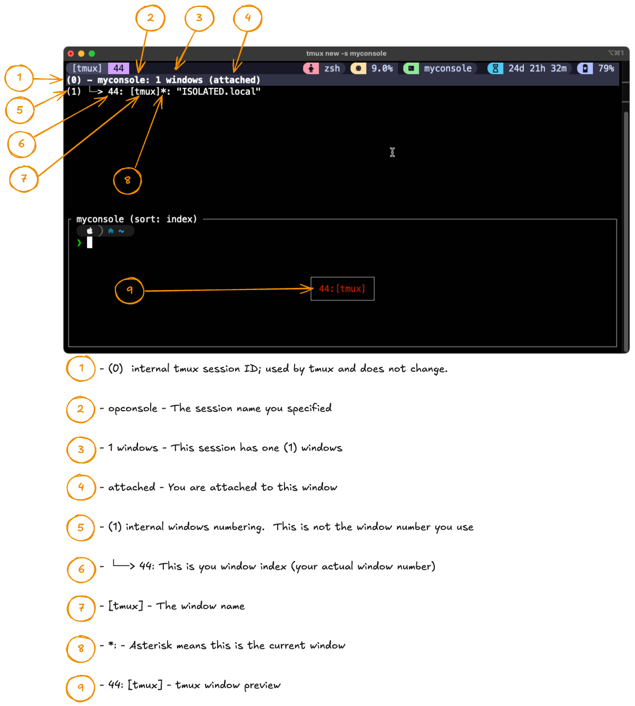
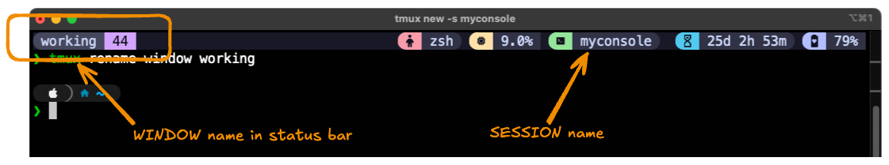
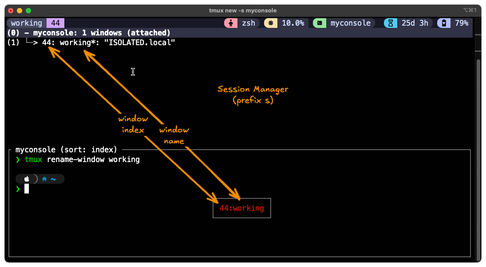
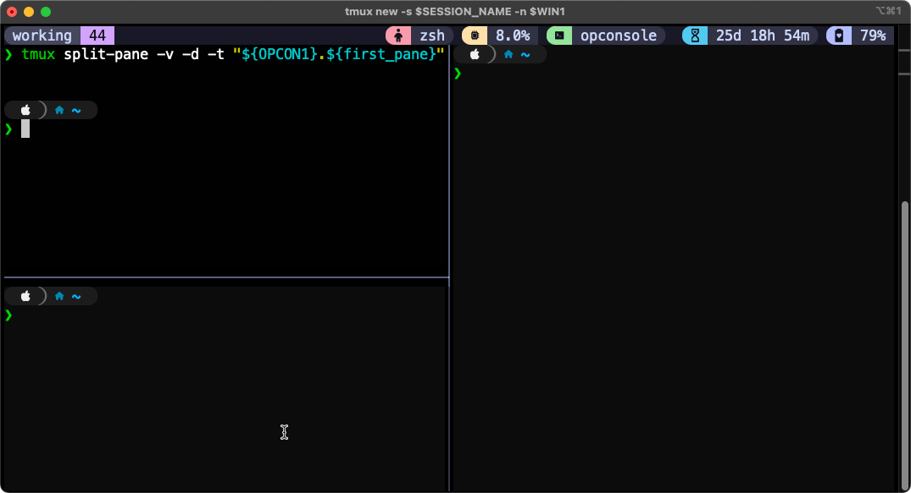
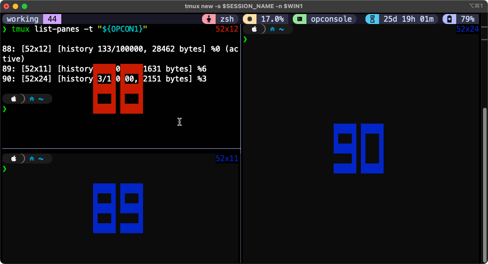
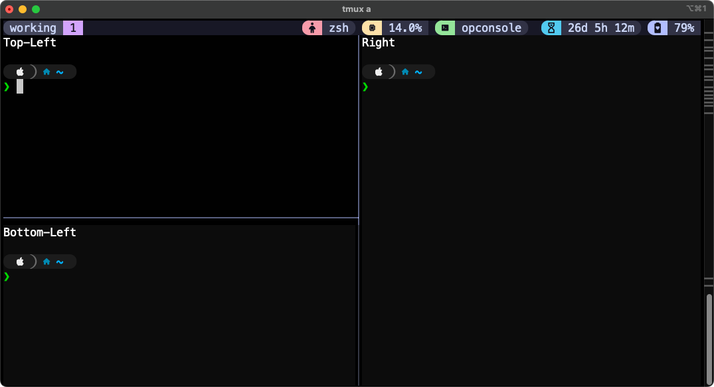

- [ ] Open a terminal.

- [ ] Run `watch -n 1 stty size`.  The output will be two numbers.

- [ ] With the `watch` still running, maximize your terminal so it uses the entire display.  The two numbers will update (Example: **94 381**).  The first number is the **y** value of your terminal (the number of ***lines*** or the height of your display).  The second number is the **x** value of your terminal (the number of ***columns*** or the width of your display).

> Note: These are different values than your screen resolution, which is in pixels.

> Note: In this example of **94 381**, the terminal is 381 characters wide and you can see 94 lines from top to bottom.

- [ ] Document these values. Record them as:
* **x - MAXCOLS**  ↔️ 
* **y - MAXLINES** ↕️

***

- [ ] With your screen still maximized, press CTRL-c to stop the `watch -n 1 stty size` command.  Confirm your **x** and **y** values using `tput lines` and `tput cols`.

```bash
❯ stty size
94 381

❯ tput lines
94

❯ tput cols
381
```

- [ ] Edit your `~/.bashrc` or `~/.zshrc`, adding the following (change the values to match your system):

```bash
cat << EOF >> ~/.zshrc
export MAXLINES=94
export MAXCOLS=381
EOF
```

- [ ] Source your config file and confirm the variables are available in your shell.

```bash
source ~/.bashrc  #or ~/.zshrc

echo $MAXLINES

echo $MAXCOLS
```

***

- [ ] Edit your `tmux.conf` file to include:
```
set -g base-index 44                     # Start window numbering at 1 rather than 0
setw -g pane-base-index 88               # Start pane numbering at 1 rather than 0
set -g renumber-windows on              # renumber all windows when any window is closed
```

> Note: The **base-index** and **pane-base-index** values above are intentionally exaggerated for illustration.  At the end of this exercise you will set them to more appropriate values.

Make sure there are not tmux sessions running.

```bash
tmux kill-server

# and confirm

tmux ls
```

- [ ] Create a new tmux session named **myconsole**.

```bash
tmux new -s myconsole
```

> Note: If you have not modified your tmux.conf as indicated above, your numbering will start at the default of `0` rather than `44`.  This entire document assumes you are using a modified **tmux.conf**.

Enter `prefix s` to open Session Manager.  You see:

```
(0) + myconsole: 1 windows (attached)
```

Press the right arrow key (or Enter key) to expand the session.  You see.



Press Enter or ESC to close the Session Manager.

*** 

- [ ] Rename the window using `tmux rename-window <name>`.

```bash
tmux rename-window working
```



***

- [ ] View the changes in Session manager (`prefix s`).



Press Enter or ESC to close the Session Manager.

***

- [ ] From a scripting perspective, all of that that could have been done more efficiently.  To demonstrate, first kill the session.

```bash
tmux kill-session
```

***

You can create a new tmux session, give it a name, and name the first window in a single command using:
`tmux new -s <session_name> -n <window_name>`.

- [ ] Re-create the **myconsole** session with the **working** window using the syntax described above.

```bash
tmux new -s myconsole -n working
```

***

- [ ] Now, split the working window into two horizontal panes.

> Note: While tmux `split-window -h` works when you're in the right window, we'll use the `-t` flag to specify exactly which window to split. This is especially important when scripting or working with detached sessions or multiple windows.

```bash
tmux split-window -h -t myconsole:working
``` 

***

Notice that when you create this new pane you are connected to it (i.e., your cursor moves to the new pane).  If you want to create a new pane but not switch to it create the split with the `-d` syntax added (`tmux split-window -d -h -t myconsole:working`).

- [ ] Kill the newly created pane by typing `tmux kill-pane` (with your cursor in that pane).

```bash
tmux kill-pane
```

You should now have just one pane.

***

- [ ] Re-create the pane but keep your cursor detached from the new pane (keep the cursor in the current pane.)

```bash
tmux split-window -d -h -t myconsole:working
```

The new pane should open to the right and your cursor should remain in the left pane.

***

- [ ] View the pane index numbers using `prefix q`.  They should be **88** (left pane) and **89** (right pane).

> Reminder: for this lab the starting pane index was set in `tmux.conf` to an artificially high value of **88** (`setw -g pane-base-index 88`) in order to clearly differentiate what was a pane index value (from other index values).  Normally, pane indexing starts at **0**.

***

- [ ] Kill the right pane (**89**) using `tmux kill-pane -t myconsole:working.89`

```bash
# Syntax:
# tmux kill pane -t session_name:windows_name.pane_index

tmux kill-pane -t myconsole:working.89
```

> Note: If your cursor was in pane **89** you could kill the pane with just `tmux kill-pane`.  Using the target (`-t`) syntax allows you to control the pane regardless of where your cursor is focused.

***

You can create a new pane and immediately run a command in the pane.  This is more useful for long-running commands (ping, htop, tcpdump, etc.).  The pane will only remain open while the command is running.  As soon as the command completes, the pane will close.

- [ ] Create a new horizontal pane and run a short-lived command.  The pane will be created, the command executed and then the pane will close.

Note the following as you run the command below:
* `-d` keeps your cursor from moving to the new pane.
* After the 8th ping, the pane closes.

```bash
tmux split-window -d -h -t myconsole:working ping -c 8 1.1.1.1
```

***

- [ ] Recreate the pane with a command that runs indefinitely.

```bash
tmux split-window -d -h -t myconsole:working htop
```

***

- [ ] Kill the pane when you don't need the [`htop`] command any longer.  Use `prefix q` to determine the pane index.  It should be **89**.

```bash
tmux kill-pane -t myconsole:working.89
```

> Important Note: When scripting there is no easy way to know what the pane index will be.  You have to think it through and know what the pane index for a given pane will be.  In scenarios where a window has multiple panes, this can become confusing and will requires some careful planning to avoid splitting, closing or running the wrong command in the incorrect pane.  You can get a list of currently active panes using `tmux list-panes -t target`.  For example: `tmux list-panes -t myconsole:working`.  If you are using the tmux window, `prefix q` temporarily displays the pane index(es) on screen.

***

- [ ] Close the tmux session to clean the slate and start fresh.

```bash
tmux kill-session
```

You are no at a regular CLI prompt.

***

- [ ] Create variables to hold your session and window name.

```
export SESSION_NAME="myconsole"
export WIN1="working"
```

> Note: The variables must be exported or they will not be available to the new tmux session.

***


- [ ] Using your newly created variables, create a new tmux session with a named window.  

```bash
tmux new -s $SESSION_NAME -n $WIN1

***

- [ ] Split the `$WIN1` window into two (2) panes.

```bash
tmux split-window -d -h -t "${SESSION_NAME}:${WIN1}"
```

***

- [ ] List your pane index values using `tmux list-panes -t "${SESSION_NAME}:${WIN1}" -F "#{pane_index}"`.

```bash
tmux list-panes -t "${SESSION_NAME}:${WIN1}" -F "#{pane_index}"
```

In this lab, you should get 88 & 89.  In an unmodified system you will likely get 0 and 1.

***

Programmatically you may not know what the pane index is.  It is `0` by default but is often set to `1` by users (in `tmux.conf`).  In this lab it is set to `88` for illustration purposes.  If you want your scripting to be portable and usable by a wide array of users you have to NOT make assumptions about what the index values will be and, instead, determine the index programmatically.  

The first pane is the lowest index number, whatever that is.  Here is one way you can get that value.

```bash
tmux list-panes -t "${SESSION_NAME}:${WIN1}" -F "#{pane_index}" | sort | head -n1
```

***

- [ ] Using the syntax above, set the first pane index to a variable.

```bash
first_pane=$(tmux list-panes -t "${SESSION_NAME}:${WIN1}" -F "#{pane_index}" | sort | head -n1)

# And confirm
echo $first_pane
```

***

- [ ] Using your variable, select the first pane.

```bash
tmux select-pane -t "${SESSION_NAME}:${WIN1}.${first_pane}"
```

> Note: Your cursor is was already in the desired pane so nothing appears to have happened when the command above was run.  Remember this these lab steps are focused on scripting the use of sessions, windows and panes so this step is more to illustrate how to select panes.

***

- Typing out **`${SESSION_NAME}:${WIN1}`** is getting repetitive.  Create a more concise variable to hold both values.

```bash
OPCON1="${SESSION_NAME}:${WIN1}"

# And confirm
echo $OPCON1
```

- [ ] Using your new variable, split the selected pane vertically.

```bash
tmux split pane -v -d -t "${OPCON1}.${first_pane}"
```




***

- [ ] View the pane indexes.

```bash
tmux list-panes -t "${OPCON1}"

# or

tmux list-panes -t "${SESSION_NAME}:${WIN1}"
```

The panes have been re-indexed.  Pane 88 is the same value but the new pane has been numbered 89 and the previous 89 has been pushed down to 90.  YOu can confirm this using `prefix q`.

```bash
prefix q
```



***

Using `tmux send-keys` you can send keystrokes (commands) to panes.  To test this, send commands to each of the panes.

> Note: This is another situation where simply typing the command in the active pane would be easier.  But the focus of these lab steps is on scripting the running of these commands.

```bash
# Send command to pane 90
tmux send-keys -t "${OPCON1}.90" "clear; ip addr show >&2" C-m

# Send command to pane 89
tmux send-keys -t "${SESSION_NAME}:${WIN1}.89" "clear; arp --help" C-m

tmux send-keys -t "${OPCON1}.${first_pane}" "clear; wg --help" C-m
```

> Important Note: The `C-m` at the end effectively presses Enter to run the command.  If you remove the `C-m` the keystrokes will be entered but Enter will not be pressed.  In effect, you are staging command in the pane.  You come to the pane later and press enter to complete the running of the command.

***

- [ ] Kill the tmux session to create a fresh start.  If you are being thorough in your scripting, kill the session by specifically targeting the session (rather than just running `tmux kill-session`, run `tmux kill-session -t "${SESSION_NAME}"`).

```bash
tmux kill-session -t "${SESSION_NAME}"
```

***

Summary of what was done above:
You used the following commands:
* You created variables to hold session, window and pane information.
* You used `tmux` commands to create sessions, windows, panes and the select panes and run commands in panes.

| tmux command | What it does |
|:--|:--|
| `tmux new` (or `tmux new-session`) | Creates a new tmux session. Add `-d` to stay detached when creating the session.
| `tmux split-window -d -h -t session:window` | Split a window (horizontally). Here `-d` prevents you from switching to the new pane.
| `tmux split-window -d -v -t session:window` | Split a window (vertically).
| `tmux list-panes -t session:window` | List panes with their index values.
| `tmux select-pane -t session:window.pane` | Select a pane.
| `tmux send-keys -t session:window.pane command C-m` | Send a command to a pane.

> 💡 Tip: Using -d (detached) ensures your script runs all commands before you enter the session, giving you a ready-to-go layout when you attach.

***

- [ ] Edit your `tmux.conf` so both window and pane numbering starts at one (1).

> Note: The default is 0.  Many people prefer 1 because of the keyboard layout of 0.

```
set -g base-index 1
setw -g pane-base-index 1
```

***

## tmux Challenge #1

In this challenge, create your session, window and panes in detached mode.  Also use the **MAXLINES** and **MAXCOLS** variables you set earlier to 'pre-claim' the space for the tmux session.  

> When using **MAXLINES** and **MAXCOLS**, you will need to maximize the terminal to correctly render the tmux display.

- [ ] Starting from scratch, write out the command-steps to create the layout below.  Write the commands in a text/code editor so you can work with the order before running them in a terminal.  Define variables for the session and window name.  Create the session in detached mode (Ex: `tmux new -d -s "${SESSION}" -n "${WIN1}"`.

> Hint #1: `tmux new -d` creates a new session but stays detached.  If you leave out the `-d` you will connect to the session when you create it.

> Hint #2: `tmux new-window` and `tmux split-window` use `-d` to prevent you from switching to the new window or pane being created.  Without it, you will switch to the new window/pane automatically.

### Challenge #1: Goal

```
----------------------+----------------------
| Top-Left            | Right               |
|                     |                     |
|                     |                     |
|                     |                     |
|---------------------+                     |
| Bottom-Left         |                     |
|                     |                     |
|                     |                     |
|                     |                     |
---------------------------------------------
```

- [ ] After creating the session, window and panes, use `tmux send-keys` to send an `echo <location>` command to each pane to tag the position of the pane in the window (Ex: `tmux send-keys -t "${SESSION}:${WIN1}.1 echo top-left C-m"`).

*** 

### Challenge #1:  Planning

Plan your commands in a code/text editor.

1. Define your variables (session and window).
2. Create the session (use `-d` to stay detached).
3. ...
4. ...
5. ...

***

### Challenge #1:  Implementation

- [ ] After you document the commands you would use to create the layout, try them in the terminal.  After you enter all the commands, attach to the tmux session you created (`tmux attach -t "${SESSION_NAME}"`) to see if the result is what you expected.

> If you need to try again, use `tmux kill-session` to clear out the session so you can start fresh each time.

> Note: One possible solution is at the end of this document.

***

Once you are successful in the creation of the layout in Challenge #1, continue to Challenge #2.

***

## tmux Challenge #2

- [ ] Starting from scratch, write out the command-steps to create the layout below.  Write the commands in a text/code editor so you can work with the order before running them in a terminal.  Use the same session as you did in Challenge #1 (i.e. you are adding an additional window to an existing session.

The Session should continue to be "myconsole".
Window #2 should be named "monitor".

### Challenge #2: Goal

```
----------------------+----------------------
| Top-Left            | Top-Right           |
|                     |                     |
|                     |                     |
|                     |                     |
|---------------------+---------------------|
| Middle-Left         | Middle-Right-Upper  |
|                     |                     |
|                     |---------------------|
|                     | Middle-Right-Lower  |
|                     |                     |
|-------------------------------------------|
| Bottom                                    |
|                                           |
|                                           |
---------------------------------------------
```

- [ ] After creating the session, window and panes, use `tmux send-keys` to send an `echo <location>` command to each pane to tag the position of the pane in the window (Ex: `tmux send-keys -t "${SESSION}:${WIN1}.1 echo top-left C-m"`).

*** 

### Challenge #2:  Planning

Plan your commands in a code/text editor.

1. ...
2. ...
3. ...
4. ...
5. ...

***

### Challenge #2:  Implementation

- [ ] After you document the commands you would use to create the layout, try them in the terminal.  After you enter all the commands, attach to the tmux session you created (`tmux attach -t "${SESSION_NAME}"`) to see if the result is what you expected.

> If you need to try again, use `tmux kill-session` to clear out the session so you can start fresh each time.

> Note: One possible solution is at the end of this document.

***

## tmux Challenge #3

### Challenge #3: Goal

Take the work you did in Challenge #1 and Challenge #2 and combine it into a simple script to automate the creation of the session, both windows, the panes in the windows and the commands to execute in each pane (in both windows).

- [ ] Also add a third window with two panes, split vertically.

Window #3, named **survey**, should look like this:

```
---------------------------------------------
| Top                                       |
|                                           |
|                                           |
|                                           |
|-------------------------------------------|
| Bottom                                    |
|                                           |
|                                           |
|                                           |
---------------------------------------------
```

- [ ] As before, use `tmux send-keys` to send the appropriate `echo` command to the correct pane.

- [ ] Add additional logic that kills the $SESSION if it is already running when you run the script.

- [ ] The base structure for your script should be:

```bash
#!/bin/bash

# Set variables (SESSION, WIN1, WIN2, etc.)

# Kill pre-existing session.  Use:
if tmux has-session -t $SESSION 2>/dev/null; then tmux kill-session -t $SESSION; fi

# Create new session and name window #1

# Divide window #1 into panes

# Use tmux send-keys in window #1 to send commands to panes

# Create window #2

# Divide window #2 into panes

# Use tmux send-keys in window #2 to send commands to panes

# Create window #3

# Divide window #3 into panes

# Use tmux send-keys in window #3 to send commands to panes
```

- [ ] After assembling your script, mark it executable and run it.  The correct end result is the session is created with three windows divided into the correct panes and the correct command runs in each pane.  Debug as necessary until you get it right.

***


***

# Appendix

## tmux Challenge Solutions

***

### Challenge #1: Creating the **working** window and its panes in the **myconsole** session.

```bash
SESSION="myconsole"
WIN1="working"

tmux new -d -s $SESSION -n $WIN1  -x $MAXCOLS -y $MAXLINES

tmux split-pane -d -h -t $SESSION:$WIN1

# Not a necessary command
# tmux list-panes -t "${SESSION}:${WIN1}"

# Not a necessary command
# tmux select-pane -t "${SESSION}:${WIN1}.1"

tmux split-pane -d -v -t "${SESSION}:${WIN1}.1"

tmux send-keys -t "${SESSION}:${WIN1}.1" "clear; echo Top-Left" C-m

tmux send-keys -t "${SESSION}:${WIN1}.2" "clear; echo Bottom-Left" C-m

tmux send-keys -t "${SESSION}:${WIN1}.3" "clear; echo Right" C-m
```

```bash
tmux attach -t "${SESSION}"
```

***

### Challenge #1 Result



***

### Challenge #2: Solution

```bash
WIN2="monitor"
tmux kill-window -t $SESSION -n $WIN2 

tmux new-window -d -t $SESSION -n $WIN2
tmux split-pane -d -v -t "${SESSION}:${WIN2}.1"
tmux split-pane -d -v -t "${SESSION}:${WIN2}.1"
tmux split-pane -d -h -t "${SESSION}:${WIN2}.1"
tmux split-pane -d -h -t "${SESSION}:${WIN2}.3"
tmux split-pane -d -v -t "${SESSION}:${WIN2}.4"

tmux send-keys -t "${SESSION}:${WIN2}.1" "clear; echo Top-Left" C-m
tmux send-keys -t "${SESSION}:${WIN2}.2" "clear; echo Top-Right" C-m
tmux send-keys -t "${SESSION}:${WIN2}.3" "clear; echo Middle-Left" C-m
tmux send-keys -t "${SESSION}:${WIN2}.4" "clear; echo Middle-Right-Upper" C-m
tmux send-keys -t "${SESSION}:${WIN2}.5" "clear; echo Middle-Right-Lower" C-m
tmux send-keys -t "${SESSION}:${WIN2}.6" "clear; echo Bottom" C-m

tmux attach -t "${SESSION}:${WIN2}"
```

### Challenge #1: Result


***