# Just Enough Vim: A Crash Course

> Note: This document is part of a GitHub repo.  Unless in PDF format, it is meant to be read as part of the repo.  Images included are relative references within the repo.

The overview section is comprised of tables describing various keystrokes used with vim.  They are intended to be a reference as you work through this lab exercise.

Please also refer to the quick reference guide located at `reference-guides/vim-qrq-concise.md`.
The lab steps begin with the **Lab Steps** section.

## Overview

**Vim** is massive in its command syntax.  That makes it simultaneously both powerful and confusing.  The learning curve is legitimate and scares many away, sending them running to the relative comfort and familiarity of **nano**.

This "brief" **vim** tutorial covers the basics; just enough to make you competent with `vim` without trying to scare you with excessive syntax.

## Summary of Vim Modes

Vim has several modes.  They are:
* [Normal](#normal-mode-default-mode)
* [Insert](#insert-mode)
* [Visual](#visual-mode)
* [Command-Line](#command-line-mode)
* [Replace](#replace-mode-overwrite-mode)
* [Select](#select-mode)

Most of your time will be spent in **Normal** and **Insert** modes, followed closely by **Visual** and **Command-Line** modes.

***

### Normal Mode (default mode)
* Vim starts in **Normal** mode.
* **Purpose**: Navigate, edit, and issue commands.
* **Key Features**:
    * Move around (`h` (left), `j` (down), `k` (up), `l` (right)
        * Arrow keys work, too ⬅️ ⬆️ ⬇️ ➡️ 
    * More move around:
        * `w` - forward a word
        * `b` - back a word
        * `^` - goto beginning of line
        * `$` - goto end of line
        * `gg` - goto first line of file 
        * `G` - goto last line of file
        * `J` - jump to top of visible screen
        * `L` - jump to bottom of visible screen
        * `M` - jump to middle of visible screen
        * `{` - Jump backward a paragraph (or beginning of current paragraph)
        * `}` - Jump forward a paragraph (or end of current paragraph)
    * Edit commands (`d` (delete), `y` (yank), `p` (paste), `x` (delete character))
        * See below for more detail
* **Mode Entry**: ESC from any other mode

***

### Insert Mode
* For most users, this mode is 'normal' in context of how other text editors work.  In this mode, you type to add information to the document.
* **Purpose**: Insert/Edit text
* **Mode Entry**:
    * `i` - insert mode at cursor position (i.e. to the left of the cursor)
    * `a` - insert mode after cursor (i.e. to the right of the cursor)
    * `I` - insert mode at ***beginning*** of line
    * `A` - insert mode at ***end*** of line
    * `o` - insert mode ***below*** current line (adds new blank line)
    * `O` - insert mode ***above*** current line (adds new blank line)
* **Mode Exit**: ESC

***

### Visual Mode
* **Purpose**: Select text for editing/copying
* **Mode Entry**: 
    * `v` - select character-by-character (aka **Visual Mode**)
    * `V` - select line-by-line (aka **Visual Line Mode**)
    * `Ctrl-v` - select rectangular blocks of text (aka **Visual Block Mode**). Useful when you want to select "columns" of text across multiple lines (but not the entire line)
* **Mode Exit**: ESC

***

### Command-Line Mode
* **Purpose**: Execute commands (save, quit, search, replace)
* **Mode Entry**: 
    * `:` - for commands
        * `:#` - go to line `#`
        * `:w` - write (save file)
        * `:q` - quit (close)
        * `:wq` - write & quit (close)
        * `:q!` - quit without saving
        * `:set number` - turn on line numbers
        * `:set nonumber` - turn off line numbers
        * `:set relativenumber` - numbers lines above/below relative to cursor position
        * `:set norelativenumber` - turns off relative line numbers
        * `:!<command>` - run a shell command without leaving vim (Ex: `:!ip addr show`)
    * `/<string>` - forward search (down document)
        * `n` next instance
        * `N` previous instance
    * `?<string>` - backward search (up document)
    * `%s:/old/new/g` - search for `old` and replace with `new` globally (`g`)
* **Mode Exit**: ESC

***

### Replace Mode (Overwrite mode)
* **Purpose**: Overwrite characters as you type
* **Mode Entry**: `R`
* **Mode Exit**: ESC

### Select Mode
* **Purpose**: Similar to visual mode but text selection is more GUI-like (if supported)
* **Mode Entry**: Use mouse to select text
* **Mode Exit**: ESC

***

## Yank, Delete & Paste

In vim:

| Command | Regular Term | vim Term
|:--:|:--|:--|
| `d` | cut | delete
| `y` | copy | yank
| `p` | paste | put

***

## Summary of Most Common Yank, Delete & Paste Actions

> These are only some of the yank, delete & paste options.

| Action | Command | What it Does
|:--|:--|:--|
| Yank (Copy) | `y` | **Visual Mode** - Yank (copy) selected text to unnamed register
| | `yy` | **Normal Mode** - Yank (copy) current line to unnamed register
| | `y{motion}` | `y$` yank to end of line, `y^` yank to beginning of line).
| | `y#y` | Yank `#` lines down.  Ex: `y8y` = yank (copy) 8 lines down from current line (including current line)
| | `y#k` | Yant `#` lines up. Ex: `y20k` = yank (copy) 20 lines up from current line (including current line)
| | `"+y` | Yank (Copy) to ***system clipboard*** (+ register).
| Cut (Delete) | `d` | **Visual Mode** - Cut (delete) selected text to unnamed register
| | `dd` | **Normal Mode** - Cut (delete) current line (into unnamed register).
| | `d{motion}` | `d$` cut to end of line, `d^` cut to beginning of line.
| | `"+d` | Cut text to ***system clipboard***.
| Paste | `p` | Paste [unnamed] register ***after*** cursor
| | `P` | Paste before cursor
| | `"+p` | Paste ***from*** system clipboard

***

## Lab Steps

- [ ] Open a terminal.

> MacOS users: use [iTerm2](https://iterm2.com/) (`brew install --cask iterm2`) or [Alacritty](https://github.com/alacritty/alacritty).  Avoid the built-in MacOS terminal.  This lab was written using iTerm2 (MacOS) and/or the built-in Ubuntu Linux terminal.

***

- [ ] (Recommended) Clone this repo to your computer.

```bash
cd

git clone https://github.com/itdojo/oh-my-cli.git

cd oh-my-cli
```

- [ ] Use `vim` to open `assets/constitution.md`.  The document opens in vim **Normal Mode**.

***

### Basic Movement in Normal Mode

Arrow keys (⬅️ ⬆️ ⬇️ ➡️) are a perfectly valid way of moving around any document.  However, using them requires users that adhere to the traditional typing position where fingers rest on ***asdf*** and ***jkl;*** (the '*home row*') to remove the right-hand from its ***jkl;*** position to use them.  For some users this also involves taking eyes off the screen to visually locate the arrow keys.  This is inefficient and slows your work flow.  For these reasons, vim supports the basic movements using `h`, `j`, `k` and `l`.  Using these keys allows you to move around the document without moving the right hand from the home row.  It also allows you to keep your eyes on the screen.

- [ ] Using `constitution.md`, take a moment to practice using `h`, `j`, `k`, and `l` for navigation. Focus on keeping your right hand on the home-row keys as you move around the document.  Try to begin using these keys rather than the arrow keys to do simple movements.

| vim command | What it does | Arrow Key Equivalent | Note 
|:--:|:--|:--:|:--|
| `h` | Moves LEFT | ⬅️ | Only works in **Normal **Mode**
| `j` | Moves UP | ⬆️ | Only works in **Normal Mode**
| `k` | Moves DOWN | ⬇️ | Only works in **Normal Mode**
| `l` | Moves RIGHT | ➡️ | Only works in **Normal Mode**

> When in **Insert Mode**, `h`, `j`, `k`, and `l` do not function for movement. While many users revert to arrow keys during **Insert Mode**, it is worth considering efficient transitions between modes (e.g., returning to **Normal Mode** for extended navigation).

*** 

### Test Additional Navigation Keys in Normal Mode

- [ ] Test the additional navigation keys in **Normal Mode**.  Use each of the keys in the following tables to get a feel for their use.

Try combining them:
* Use `w` and `b` to navigate a sentence.
* Jump to the beginning of a line with `^` and the end with `$`.
* Use `gg` and `G` to navigate through a long document.
* Jump to the beginning (`{`) and end (`}`) of a paragraph.

| vim command | What it does | Similar Shortcut | Common Use Case
|:--:|:--|:--|:--|
| `w` | Moves forward one word | None | Hold the key down to continuously jump forward
| `b` | Move back a word | None | Hold the key down to continuously jump backward
| `^` | Goto beginning of line | `0` or `Home` key | You see this same logic with tools like `grep`. `^` usually means '*starts with*'; in this case, a line.
| `$` | Goto end of line | `End` key | You see same logic with tools like `grep`. `$` often means '*ends with*' (but not with bash, zsh, etc.)
| `gg` | Goto first line of file  | `:1` in **Command Mode** |  
| `G` | Goto last line of file | `:<really_big_number>` in **Command Mode**, Ex: `:999999` | 
| `{` | Goto beginning of paragraph | None | When editing code, often used in **Visual Mode** to select entire function
| `}` | Goto end of paragraph | None | When editing code, often used in **Visual Mode** to select entire function

#### Why Use These Commands?
Users in **Insert Mode** often press or hold arrow keys for long movements, which can slow down work. It is painfully inefficient.  Instead, consider:
* Press ESC to switch to **Normal Mode** for commands like `^`, `$`, `w`, or `b` to quickly move across a line. 
* Using `gg` or `G` to jump to beginning or end of document without endless scrolling.
* Combine these commands with other **Normal Mode** operations to reduce inefficiency and increase the speed of your workflow.

***

### Working with Insert Mode Commands

**Normal Mode** commands are good for navigating around the document.  When you are ready to type additional text in your docuemnt, enter **Insert Mode**.

Many vim users only use `i` to enter **Insert Mode** for all use cases.  For instance, a user may be in the middle of a line, press `i` to enter **Insert Mode**, and then use arrow keys to move to the end of the line to begin typing new text.  This is inefficient.

Using `constitution.md`, do the following:

- [ ] Press ESC to enter **Normal Mode**.

***

- [ ] Press `gg` to go to the first line and `^` to make sure you are at the beginning of the line.

***

- [ ] Press `j` three (3) times to move down to the ***We the People** line of the Preamble.

***

- [ ] Press `w` a few times to jump forward several words.

***

- [ ] Press `j` and/or `l` to position your cursor in the middle of a word.

***

- [ ] Press `i` to enter **Insert Mode** (the text `INSERT` will appear on the command bar at the bottom of the window).  You cursor is at the left of the character you were on.

***

- [ ] Press ESC to return to **Normal Mode**.

***

- [ ] Press `a` to re-enter **Insert Mode**.  Your cursor is now on the right of the character you were on.

***

- [ ] Press ESC to return to **Normal Mode**.

***

- [ ] Press `I`.  Your cursor will be returned to the beginning of the line and you will be in **Insert Mode**.

***

- [ ] Press ESC to return to **Normal Mode**.

***

- [ ] Press `A`.  Your cursor will be moved to the end of the line and you will be in **Insert Mode**.  

***

- [ ] Press ESC to return to **Normal Mode**.

> Important Note:  The "end of the line" is where the next carriage return (CR) is.  This means your cursor may jump to what is visually a different line.  This can be confusing and frustrating as it is not always what you are expecting.

To illustrate: 
Enter `:20` to jump to line 20.  This line should begin with ***Representatives and direct Taxes shall...***.

Press `$` to jump to the end of the line.  Depending on the width of your window, the end of the line is visually several lines down (ending in ***...and Georgia three***).  This is because that is the location of the next carriage return.

***

- [ ] Enter `:4` to jump back to the opening line in the Preamble.

***

- [ ] Press `^` to return to the beginning of the ***We the People*** line.

***

- [ ] Press `o`.  You will enter **Insert Mode** on a new blank line *below* the current line.

***

- [ ] Press ESC to return to **Normal Mode**

***

- [ ] Press `k` to move up one line.  This should return you to the beginning of the ***We the People*** line.

***

- [ ] Press `O`.  You will enter **Insert Mode** on a new blank line *above* the current line.

***

- [ ] Press ESC to return to **Normal Mode**.

***

- [ ] Using `:q!` close the `constitution.md` file without saving any changes.

***

- [ ] Using `vim`, open `assets/install_zsh.sh`.

***

- [ ] Turn on line numbering by entering `:set number`.  What you type will appear in the command line at the bottom of the window.  You should now see line numbers in the left gutter of the window.

***

**Objective**: Move the `Usage` comment to a different place in the script.

- [ ] Using `j`, move down the the `Usage:` comment (~ line #7).

***

> Note: Using `}` jumps forward a paragraph/code block at a time.

- [ ] Using `dd`, cut/delete the line.  This moves the line to an *unnamed register*, which can be thought of as a vim-specific clipboard.

***

- [ ] Using `k`, move up to the blank line just after the shebang (line 2).

> Note: Using the **Command Mode** `:2` will also take you up to line #2.
> Note: Using `{` will take you to the beginning of the paragraph, which, in this case is also line #2.

***

- [ ] Use `p` to paste the comment.  The `Usage` comment should now be at the top of the comment section.

***

- [ ] Using `j`, move down to the beginning of the `check_for_root` function.

***

- [ ] Using `l`, move right to the **f** in the word **for**.

***

- [ ] Using `x`, delete **for_** so the function name is just `check_root`.

***

- [ ] Type `/check_for_root` + ENTER to search for any other instances of `check_for_root` in the script. What you type will appear in the command bar at the bottom of the window. You should be jumped to around line 177 where there is another instance of `check_for_root`.

***

- [ ] Use `l` and `x` to remove the **for_** from this instance.

***

- [ ] Press `n` to locate the next instance of `check_for_root`).  You will not find any other instances.

> Note: There could have been many instances of `check_for_root` in the script.  If so, searching for them one at a time would be tedious and time consuming.  If you know there are many instances of a string you need to change, the better syntax would be to do a global search & replace like this:  `:` to enter **Command Mode** then `%s/check_for_root/check_root/g`.  This would search for all instances of `check_for_root` and change them to `check_root`.

***

- [ ] Using `gg`, return to the top of the script.

> Note: You can also use **Command Mode** `:1` to go to line #1.

***

In this script, there is a function named **download_fonts** that is no longer needed.  It has been commented out but is still part of the code.

**Objective**: Find the **download_fonts** function, remove it and remove all instances of it being called in the rest of the script.

- [ ] Press ESC to ensure you are in **Normal Mode** and use **Command Mode** `/download_fonts` to search for the string.  You should find the commented out function around line 123.  Your cursor should be on that line.

***

- [ ] Using `:set relativenumber`, turn on relative numbering.  This will change the line numbers to be relative (above and below) to the line you are on.


> Note: If you turn on `:set number` and `:set relativenumber` the relative numbering will show the actual line number just for the line you are on.  All other numbers will be relative to the current line.  If you ***only*** turn on `:set relativenumber` the line number you are on will be zero (**0**).

***

The relative line number of `download_fonts() \{` is the actual line number (#123).  The closing curly brace for the function (`}`) is nine (9) lines below it.  The relative numbering shows you that.  You want to delete the entire commented out function so you need to delete the current line plus the next nine lines (10 lines total).  

- [ ] Using `d10d`, delete all ten lines of `download_fonts` function.

***

- [ ] Search the script for any instances of `download_fonts` being called and use `dd` to delete the line.  After deleting the line, type `n` to find the next instance and use `dd` to delete it. Repeat this until you have removed all instance of the function being called (there should be two).  You will know you have found them all when you see the message "***E486: Pattern not found: download_fonts***" at the bottom of the window.

```vim
# Search for instances of "download_fonts"
/download_fonts

# then
dd

# then 
n

# then 
dd

# etc...
```


***

- [ ] Using `gg`, return to the top of the script.

***

- [ ] Using `}` and `{` jump forward through the script one block at a time until you find the `printline()` function.

***

- [ ] Using `k` and `l`, move down to the printline that will print a line of dots (`∙∙∙∙`).

```bash
# printf "%.s∙" $(seq 1 "$(tput cols)")  # line style ∙∙∙∙∙∙∙
```

- [ ] Using `$`, jump to the end of the line.
- [ ] Press `v` to enter **Visual Mode**.  Your cursor should be on the last dot on the line.
- [ ] Press `y` to yank (copy) that single dot.
- [ ] Press `p` to paste the dot.  Repeat the pasting until the length of the sample matches the line style above and below.


***

- [ ] Repeat the above process on the line of stars (`☆☆☆☆`)using `h`, `j`, `k`, `l`, `$`, `v`, `y`, and `p` as needed.   The end result should look like the image below:

> People with OCD will understand.


***

- [ ] In the same `printline()` function use `h`, `j`, `k` and `l` to move up to the first `printf` line in the function. Move your cursor the the beginning of the `# line style ─────────` comment .  Your cursor should be on the `#` at the beginning of the comment, not the beginning of the line.


***

- [ ] Press `v` to enter **Visual Mode**.  Using `l` to move right, highlight the entire comment on this line.

> Note: `$` will accomplish the same thing.


***

- [ ] Press `y` to yank (copy) the highlighted comment.

***

- [ ] Press `}` to jump to the end of the code block.

***

- [ ] Press `p` to paste the copied comment. This illustrates copying a portion of text from a line and pasting it somewhere else in the document.

***

- [ ] Press `dd` to cut/delete the comment.

***

- [ ] Using `k` to move up and `w` to move right word by word, move back to the `#` in the `# line style ─────────` comment.

***

- [ ] Press `V` to enter **Visual Line** mode.  In this mode you copy entire lines.  The entire line should be selected.

***

- [ ] Using `j`, select all of the `printf` lines in the function.


***

- [ ] Press `y` to yank/copy them.

***

- [ ] Open a separate text edit program (VSCode, TextEdit, Notes, etc.) and attempt to paste the copied `printf` statements.  It will not work; whatever is on your system's clipboard will paste rather than the yanked `printf` statements.

***

- [ ] Return to vim and use `p` to paste the copied lines.  They paste successfully.


- [ ] Press `u` to undo the paste.

This inability to paste text copied in vim to an external program is because vim has its own 'registers' (clipboards) which are separate from the OS' clipboard.  This can be overcome once you understand some of the nuances of how vim stores yanked/cut strings.

***

- [ ] Press `{` to jump to the beginning of the function.  Your cursor should be on the line above the `printline` function.

***

- [ ] Press `V` to enter **Visual Line** mode again and use `}` to select the entire function.


***

- [ ] Type `"+y` to copy/yank the selected lines to the ***system clipboard***.

***

- [ ] Return to your external (non-vim) text editor and attempt to paste the yanked lines.  This time you should be successful.

> Note: Trying to copy text out of vim is a common source of frustration for many users.


***

The keystrokes `"+y` (and `"+d` and `"+p`) can be cumbersome.  To make the feature easier to use, the keys can be remapped to something more natural.  To do so, do the following:

- [ ] Use `:wq` to save and close the file.

***

- [ ] Create/open `~/.vimrc`, the vim configuration file.

***

- [ ] Add the following to `~/.vimrc`:

> `:wq` to save and close when done.

```vim
let mapleader = " "
nnoremap <leader>t :echo "Leader key works!"<CR>
vnoremap <leader>y "+y  " Yank to clipboard in Visual Mode
vnoremap <leader>d "+d  " Cut to clipboard in Visual Mode
noremap <leader>p "+p   " Paste from clipboard in Normal Mode
```

***

- [ ] Re-open `install_zsh.sh`.

***

- [ ] Enter `<SPACE>t` to test that the leader key you set (the spacebar) works.  The text ***Leader key works!*** should appear at the bottom of the window.


The entries you entered into `~/.vimrc` set new mappings for yanking to, cutting to and pasting from the system clipboard.  The are:

| Action | Default | `~/.vimrc mapped sequence | 
|--|--|--|
| Yank/Copy to System Clipboard | `"+y` | `<space>y` (spacebar + `y`)
| Cut to System Clipboard | `"+d` | `<space>d` (spacebar + `d`)
| Paste ***from*** System Clipboard | `"+p` | `<space>p` (spacebar + `p`)

***

- [ ] In the `install_zsh.sh` script, use `/check_for_git` to find the `check_for_git` function.

***

- [ ] Use `V` to enter **Visual Line** mode.

***

- [ ] Use `}` jump the selection to the end of the function.  The entire function should now be selected.

***

- [ ] Use your newly mapped yank-to-clipboard `<space>y` to copy the selected text to the system clipboard.  You should see a message of ***12 lines yanked to "+*** at the bottom of the window.


***

- [ ] Go to your external text editing program and paste the function text to that document.  You should be successful.


***

- [ ] In your external text editor, generate some arbitrary text and copy it to your clipboard as you normally do.


***

- [ ] In the `install_zsh.sh` file, press ESC to enter **Normal Mode**.

***

- [ ] Press `G` to jump to the end of the file.

***

- [ ] Press `o` to start a new line in **Insert Mode**.  

***

- [ ] Press ESC to return to **Normal Mode**.

***

- [ ] Use your newly mapped `<space>p` to paste the arbitrary text on your clipboard to your document.  You should be successful.


***

- [ ] Press `u` to undo the paste, removing the arbitrary text.

***

- [ ] Press `gg` to return to the top of the file.

***

- [ ] Use `/printline` to search for the `printline` function.

***

- [ ] Use `j` and `w` to move to the comment (`#`) in the `# line style ─────────` line.

***

- [ ] Press `CTRL-v` to enter  **Visual Block** mode.  

> **Visual Block** mode is the third visual mode you have worked with (**Visual** (`v`), **Visual Line** (`V`) and **Visual Block** (`CTRL-v`))

***

- [ ] Press `j`, to select each of the line style comments then press `$` to select each comment to the end of each line.


> This is different because you are now selecting only a portion of text on each line (in a column) rather than the entire line.

***

- [ ] Press `y` to yank the selection.

***

- [ ] Press ESC to enter **Normal Mode**.

***

- [ ] Press `G` to jump to the end of the file.

***

- [ ] Press `p` to paste the yanked comments.


***

- [ ] Press `u` to undo the paste.

***

- [ ] Press `:109` to jump to line #109 in the file.  This should be the beginning of the `check_for_oh_my_zsh` function.

***

- [ ] Enter `:set mouse=a` to enable mouse support.

> Note: The `a` means "all modes".

***

- [ ] If you have line numbers turned on, turn it off using `:set nonumber` and/or `:set norelativenumber`.

> If line numbering is on the line numbers will be copied when using mouse mode to select text.  This is almost never desirable.

***

- [ ] Using your mouse. select the entire `check_for_of_my_zsh` function.  You ***DO NOT*** need to right-click to choose Copy; just highlighting the text automatically copies it to the clipboard.


***

- [ ] Go to your external editor and paste the content.  You should be successful.


***

- [ ] This mouse functionality is often preferred by users.  If you like it, add `set mouse=a` to your `~/.vimrc` file.

> Note: There are other mouse options that are beyond the scope of this tutorial.  However, if you are using tmux with vim you will likely want to `set mouse=nv` in your `~/.vimrc` file and `set -g mouse on` in your `~/.config/tmux/tmux.conf` file.  This will avoid conflicts with scrolling in tmux.

***

## File Navigation using `:Explore`

vim has its own built-in file explorer.  You do not need to quit vim to move to or edit a different file.

- [ ] Open vim.

```bash
cd && vim
```

*** 

- [ ] Open the vim explorer.

```vim
:Explore

# or

:Ex
```

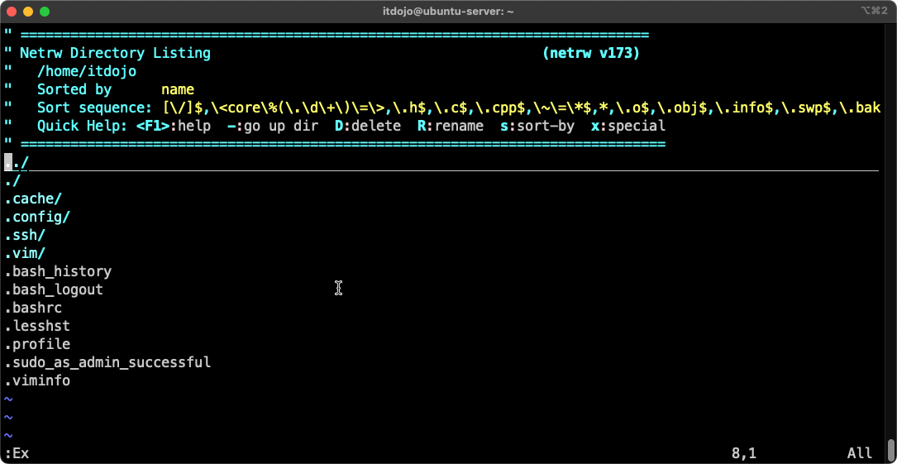

***

- [ ] Use the ⬆️ and ⬇️ arrow keys or `j` and `k` to move up and down through the files and folder.  When you to open one, press **Enter**.  Test that now by navigating the `.bashrc` and opening it.

***

- [ ] From the `.bashrc` file, return to the explorer.

```vim
:Ex

# or

:Explore
```

***

- [ ] The `../` means go to the parent directory (much like `cd ../` will do from the shell).  Navigate to `../` and move up to the parent directory.  Repeat that until you are at the root (`/`) of the filesystem.

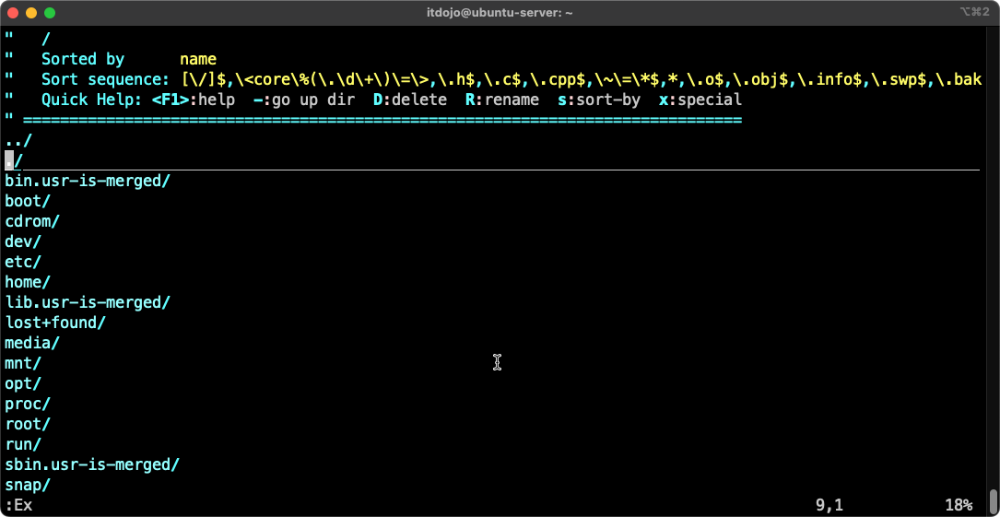

***

- [ ] Now navigate back to your home folder and into the `.ssh` folder.  Open the `authorized_keys` file.  Review its contents then return to the vim explorer and go to your home directory.

***

In the vim explorer view of the home folder, press `d` to create a new director named `vimexplore`.  Navigate to that director and press `%` to create a new file named `fileA.txt`.  Edit `fileA.txt`, adding some dummy text (`"This is fileA.txt!"`).  Save the file (ESC to enter command mode, then `:w`) but do not close it.  Return to the vim explorer.

```vim
d

vimexplore

%

fileA.txt
```

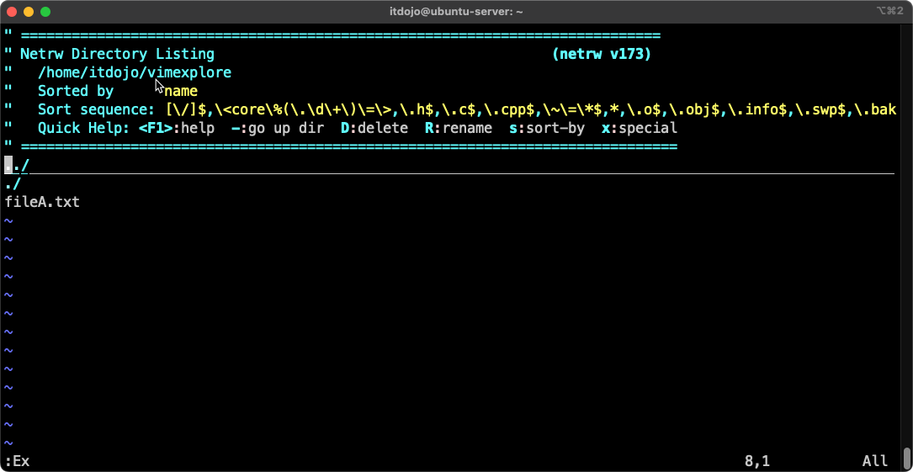

***

- [ ] In the `vimexplore` folder, create another file (`%`) named `fileB.txt` and add some dummy text.  Save it and return to the vim explorer.

***

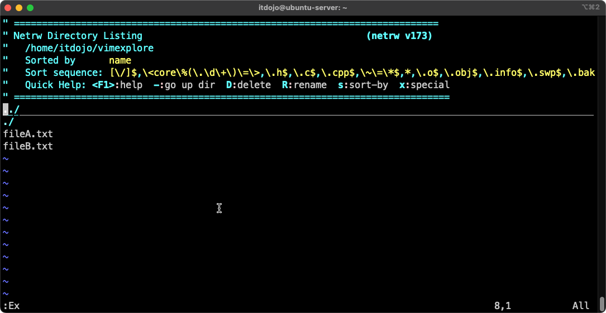

***

- [ ] From vim explorer, open `fileA.txt`.  Now switch to `fileB.txt` using vim explorer.  Make an edit to `fileB.txt` by adding some additional text.  ***DO NOT*** save `fileB.txt` and switch to `fileA.txt` using vim explorer.

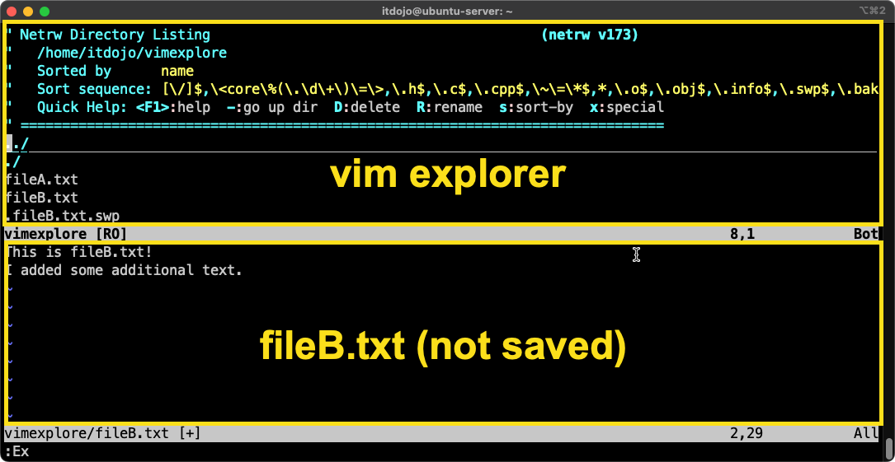


Because `fileB.txt` is not saved, a split window is opened.  `fileB.txt` is on the bottom, vim explorer is on top.  In the vim explorer pane, navigate to `fileA.txt` and open it.

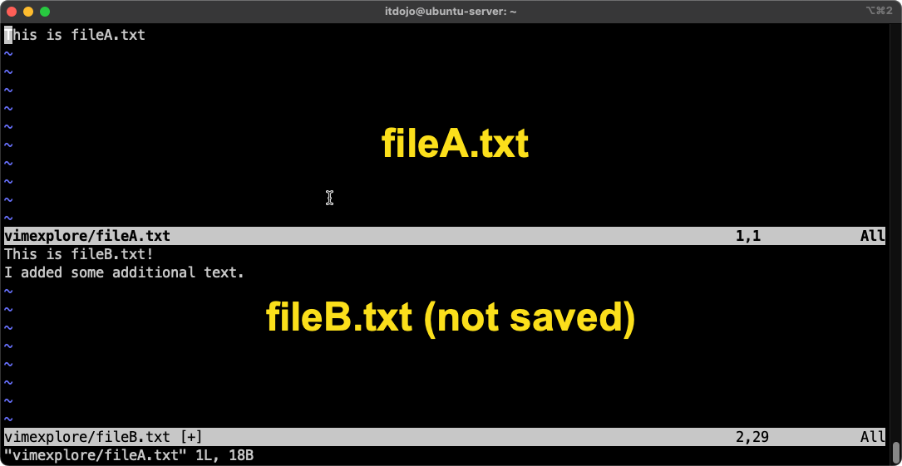

***

- [ ] Add some text to `fileA.txt` and save it (`:w`) but ***DO NOT*** close the file.

***

- [ ] Use `CTRL-w` + ⬇️ or `CTRL-w` + `j` to move down to the `fileB.txt` window.  Add some text and save (`:w`) but don't close the file.

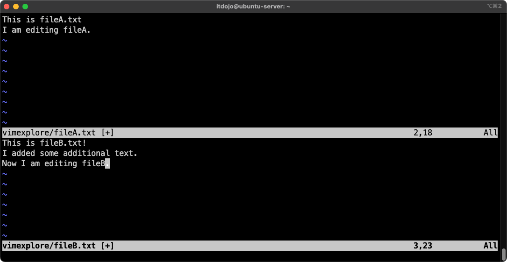

***

- [ ] Navigate back to the `fileA.txt` window and close it (`:q`).  The window will close leaving only `fileB.txt`.  Save `fileB.txt` and return to the vim explorer (`Ex:`).

If you leave a file with unsaved changes, the screen will open in a split window.  If the changes are saved before moving to the new file the window does not split.

***

## Using Buffers to Work on Multiple Files Simultaneously

- [ ] Exit vim (back to the shell) (`:q`) then re-open vim and open vim explorer (`Ex:`).

***

- [ ] From vim explorer, create two new files in `~/vimexplore` named `fileC.txt` and `fileD.txt`.  Add some dummy text to each then save and close them.

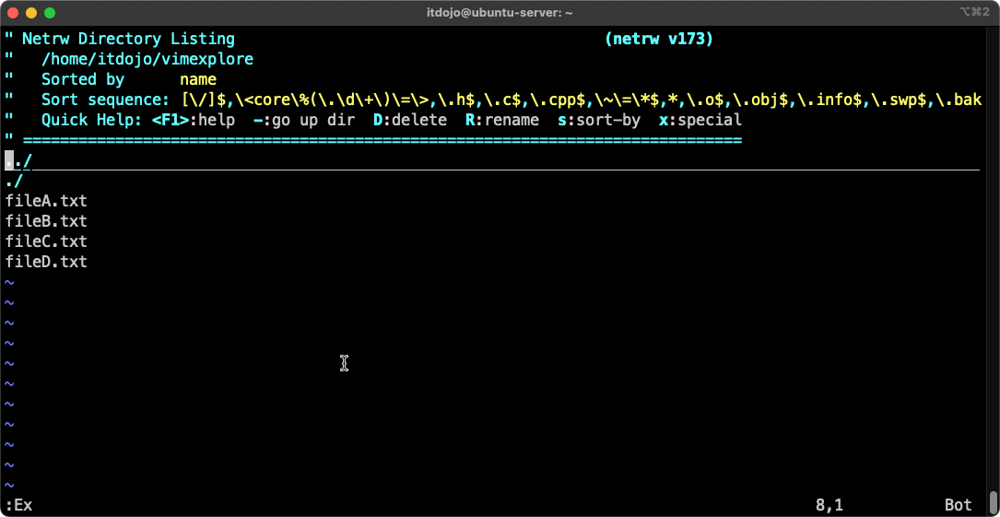

***

- [ ] Open `fileA.txt`.  

***

All files in vim live in buffers, which I think of as separate rooms.

`fileA.txt` resides in a buffer, which you can see by enter `:ls`.

```vim
:ls
```

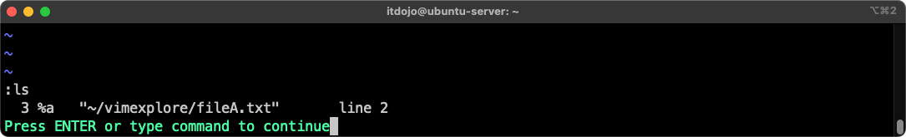

Press Enter to return to the file.

***

- [ ] Using vim explorer, switch to `fileB.txt`.  With `fileB.txt` open, view the buffers (`:ls`).  There are now two (2).

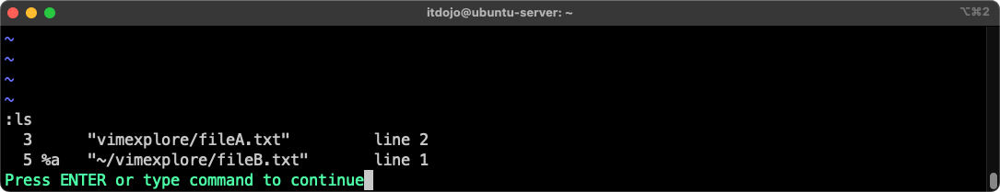

***

The leftmost number is the buffer number (**3** and **5** in the screenshot above, yours may be different).  The table below describes the other values you will see.

| Flag | Meaning
|:--:|:--|
| **%** | Current buffer
| **#** | Alternate buffer (last one used before current)
| **a** | Active (loaded in memory)
| **+** | Buffer has unsaved changes
| **h** | Hidden (not visible, but not deleted)
| **u** | Unlisted
| **=** | Buffer is read-only

***

- [ ] If you know a file's name, you do not need to use vim explorer to open it.  You can open it manually with `:e path/to/filename`.  The full path to the file is relative to where you are in the filesystem.  If you specify an incorrect path to an existing file a new one will be created in the incorrect location you entered.  Pay attention to what you are doing.  Note that this is true even if you use vim explorer to navigate to the folder where the file is located.  The `:e` command uses the path from where you started vim, not the current location of vim explorer in the file system.

Do that now.  Open `fileC.txt`.  It is likely at `vimexplore/fileC.txt` assuming you opened vim from your home folder.  After opening it, view the buffers.

```vim
:e vimexplore/fileC.txt
```

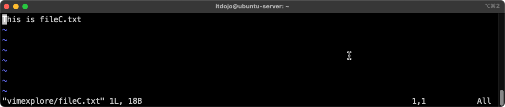

***

There are three ways to switch between buffers (between files).

> Note: If you have unsaved changes in a buffer you will get a warning and you will have to force the switch by adding a `!` (`bnext!`, `bprev!`, and `b!#`).

* `:bnext` - Goes to the next buffer
* `:bprev` - Goes to the previous buffer
* `:b #` -  Goes to buffer #.  Buffer number comes from the left column in `:ls` output.

- [ ] Do that now.  Use the three options above to cycle through the available buffers.

***

- [ ] using `:bd#`, close the buffer for `fileA.txt` (`#`) is the buffer number for `fileA.txt`.  View your buffers after closing the file to confirm it is closed.

> Like above, if you are closing a file with unsaved edits, you have to add a `!` (`bd!#`).

***

- [ ] Exit vim (`:q`).

***

## Shell Interactions Within vim

Sometimes you want to run a shell command but would rather not leave your file editing to do so.  Normally this means you would open a new tmux window or a terminal window.  vim, however, can run shell commands from within vim, no need to leave the editor (buffer).  Moreso, you can automatically add the command results to your file or to a buffer.  You also have the ability to pass data in your file (or your entire file) to a shell command to run it.  In the steps below you will examine how this works.

***

- [ ] Open vim.

```bash
cd && vim
```

***

- [ ] Enter the following text into the buffer:

```
"The DNS Server IP is 8.8.8.8" 
"Google"
```

***

- [ ] Save the file as `dnsinfo.txt` but don't close it.

```
:w dnsinfo.txt
```

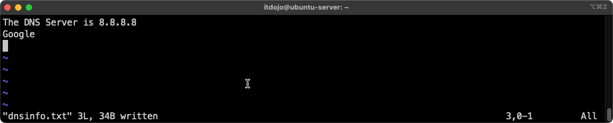

***

- [ ] Using command mode in vim, run `ip route` without leaving the editor (buffer).

> Running the command this way provides read-only output.

```
:!ip route
```

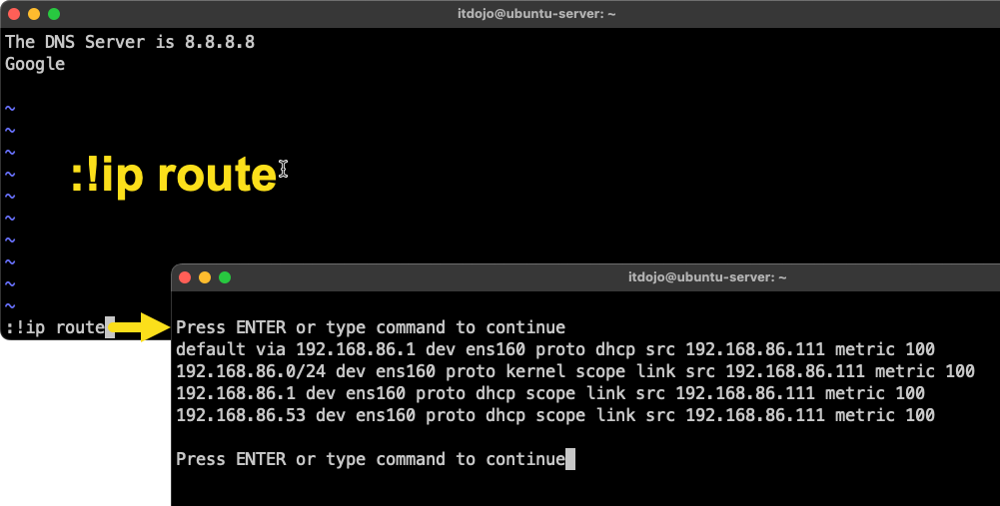

***

> Note: Change the interface as appropriate for your computer.

- [ ] Run another command: `resolvectl -i ens160`

```
:!resolvect -i ens160
```
The output should be similar to this (your DNS server will be different):

```
Link 2 (ens160): 192.168.86.53
```

***

Using `:r !<command>` you can take the results of the command you run and paste them into your document (buffer) at the position of your mouse.

- [ ] Add a new line to your document (buffer) as shown below. 

```
My DNS server IP is:  
```

- [ ] Run the `resolvectl` command from above again, this time using `awk` to extract just the IP address and paste into the file (buffer) at the position of the cursor.

```
:r !resolvectl -i ens160 dns | awk '{print $4}'
```

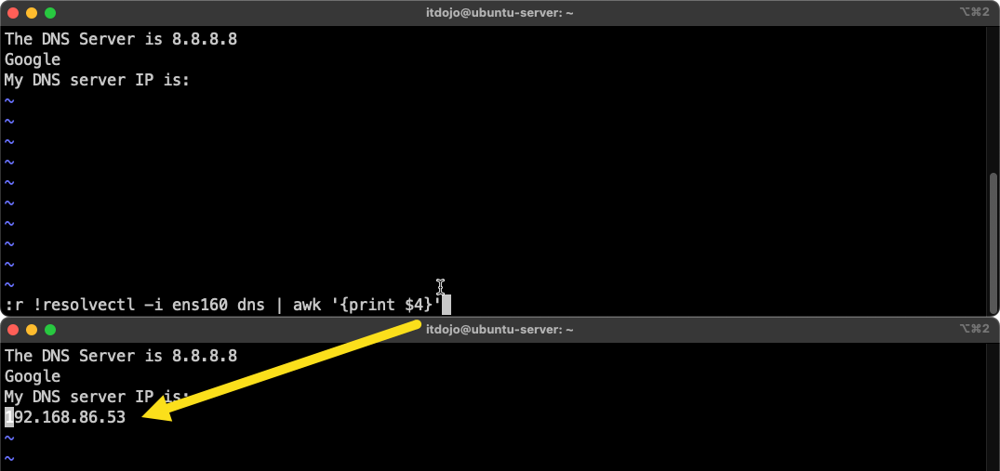

***

- [ ] Repeat that again, this time adding the entire output of `ip addr show` to your document (buffer).

> Note: `:r path/to/file` also works, copying the contents of another file into this file (buffer).

```
:r !ip addr show
```

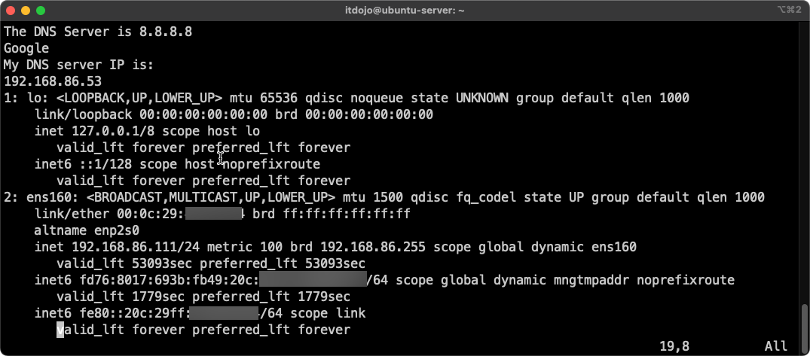

***

- [ ] Move to the top of the document (`gg`) and press `w` four (4) times to jump to the first **8** in the DNS IP address.

```
gg

w w w w
```

***

- [ ] Press CTRL-v to enter copy mode and use either the right arrow key or `l` (lowercase L) to select the enter ip address.  With the entire address selected, press `y` to yank (copy) the address to a buffer.

***

- [ ] Run the following command.  You should run 4 successful pings to 8.8.8.8.

> Note `<C-r>` is pressing CTRL-r followed by a `"`.

```
:! ping -c 4 <C-r>"
```

***

Below is a table with some additional actions you can test out on your own.

| Command | What It Does
|:--|:--|
| `:!<command>` | Run a shell command temporarily (view-only)
| `:r !<command>` | Read shell command output into the current buffer
| `:w !<command>` | Write the buffer (or a selection) as input to a shell command
| `:!ls %` | Pass the current file (%) to a shell command
| `:n, m !<command>` | Run shell command on lines n to m and replace with output
| `:w >> output.txt` | Append current file to output.txt (shell redirection)
| `:r /path/to/file.txt` | Read and insert contents of a file into the buffer
| `:!chmod +x %` | Make the current file executable
| `:!python3 %` | Run the current Python script
| `:!make` | Run Makefile from within vim


***

That's it! You now know enough to be dangerous with vim.

If you commit to using vim for a brief period you will quickly internalize all of these commands (and more) and you will have a better, faster workflow as a result. 

***

End.